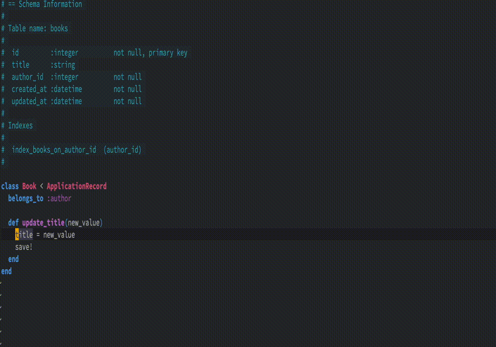
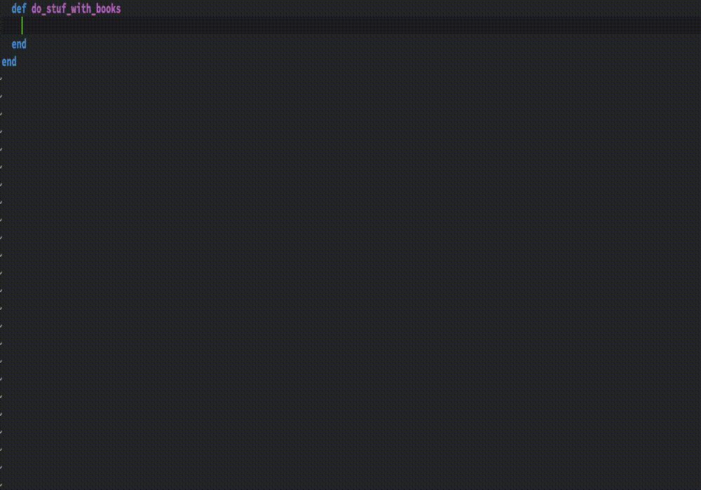
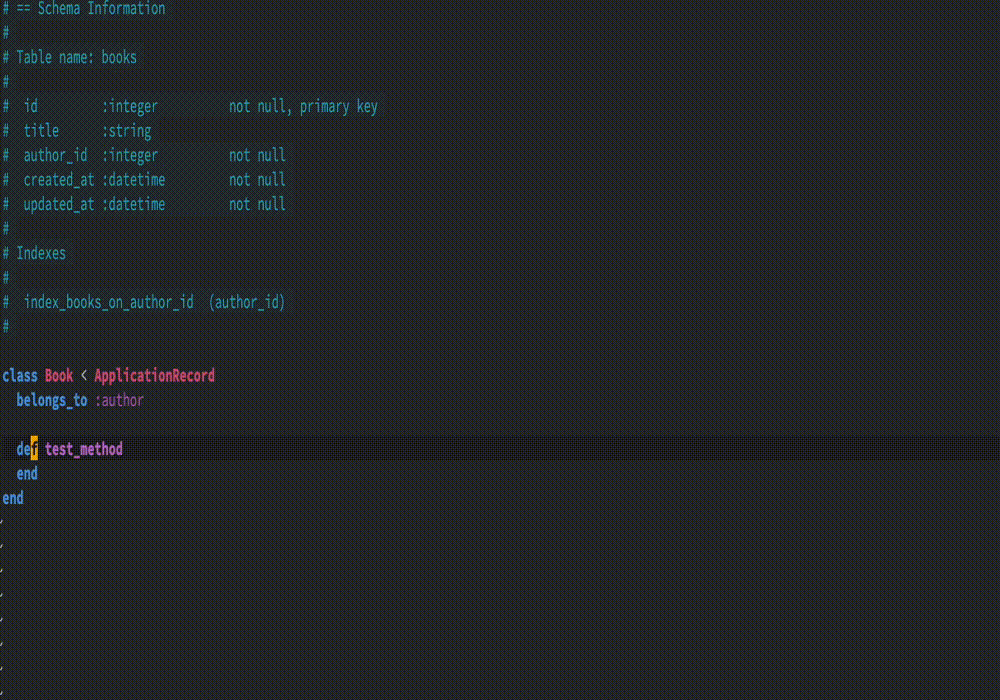
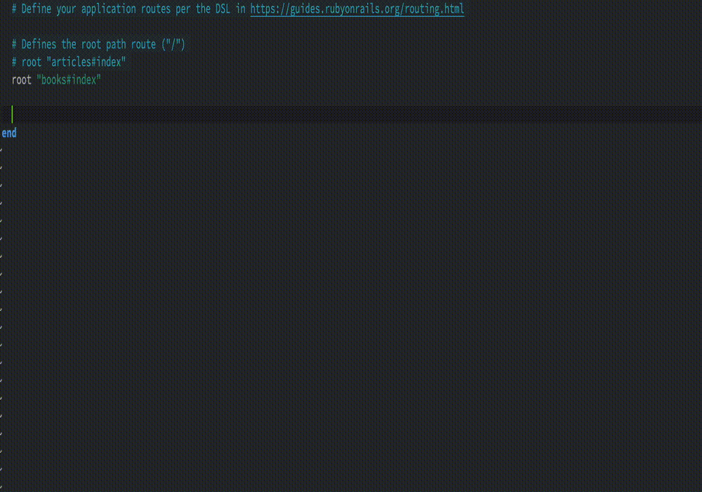

# Solargraph::Rails - Help solargraph with Rails

## Models
Given a typical Rails model like this:

```ruby
# == Schema Information
#
# Table name: my_books
#
#  id         :integer          not null, primary key
#  author     :string
#  name       :string
#  created_at :datetime         not null
#  updated_at :datetime         not null
#
class MyBook < ApplicationRecord
  def my_method
    "hello"
  end

  ...

end
```

The various Ruby intellisense tools are ok at knowing that there is a `MyBook` constant, and some (including Solargraph) are aware that objects like `MyBook.new` have a method `.my_method`. But what about those magical dynamic attributes that ActiveRecord creates when Rails starts up? You can see these listed at the top of the file under `# == Schema Information`, the comments helpfully added by the Annotate gem.

Since these attributes are only created at runtime, static analysis alone can't identify them. Your editor has no idea that these attributes exist, but they're amongst the most common things that you will work with in any Rails app.

That's where this plugin for Solargraph comes in: it parses the database schema and YARD docs of various gems to give Solargraph some extra hints. For instance database attributes:

 

 ... or ActiveRecord finders:

 

 ... or associations:

 

 ... or routes file:

 

and more!

## Installation

###  Install `solargraph` and `solargraph-rails`

If you add them to your Gemfile, you'll have to tell your IDE plugin to use bundler to load the right version of solargraph.

### Add `solargraph-rails` to your `.solargraph.yml`

(if you don't have a `.solargraph.yml` in your project root, you can run `solargraph config` to add one)

```
plugins:
  - solargraph-rails
```

### Build YARD docs
In the project root, run `yard gems`.

## Contributing
Bug reports and pull requests are welcome on GitHub at https://github.com/iftheshoefritz/solargraph_rails.

1. create fork and clone the repo

2. install gem deps `bundle install`

3. install dummy rails app deps and build the yard cache:

```
$ cd spec/rails5
$ bundle install && yard gems
$ cd ../../
```

(and the same for rails 6 and rails 7)

4. now tests should pass locally and you can try different changes

5. sumbit PR

## License

The gem is available as open source under the terms of the [MIT License](https://opensource.org/licenses/MIT).
